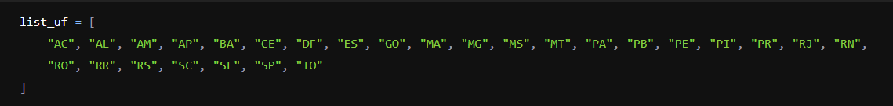

# Projeto ETD

## Descrição:

A Sirius Corporate ganhou uma licitação para atuar em um projeto do Tribunal Superior Eleitoral, e você foi contratado para compor a equipe de Engenharia de Dados.

Algumas das atividades sob sua responsabilidade incluem trabalhar com os dados disponíveis no site do TSE (https://dadosabertos.tse.jus.br/).

Como 2024 é um ano de eleições municipais, você deverá iniciar suas atividades manipulando os dados de candidatos dos anos de 2024, 2020 e 2016.

## Atividade 01: Criar um diretório em seu computador, realizar o download dos arquivos e descompactar os arquivos nesse diretório.

## Atividade 02: Como os arquivos estão separados por estados, criar uma lista com o nome “list_uf” que irá conter todas as UFs do Brasil;

## Atividade 03 – Para uma melhor organização do nosso projeto, criar um Dicionário com o nome “dict_diretorio” que irá ajudar a identificar por tipo de arquivo, para qual diretório ele deverá ser movimentado;

## Atividade 04 – Após a criação da lista e do dicionário, criar uma rotina para ler o diretório raiz e realizar a movimentação dos arquivos conforme encontra-se no dicionário.

## Atividade 05 – Depois de movimentar os arquivos para os diretórios corretos, eles precisam ser organizados por UF. Caso o diretório da UF não exista, o mesmo deverá ser criado em tempo de execução.

## Atividade 06 – Após “arrumar” o ambiente de trabalho, verificar se restou algum arquivo no diretório raiz (local onde os arquivos foram descompactados). Caso exista, na lista de UF, deverá ser inserido um elemento com o nome “Outro” e no dicionário Diretório também é necessário realizar a inclusão de um diretório para que ele seja movimentado.

## Tecnologias utilizadas:

- Python.

## Autor:

- Github: [Nathan Arrais;](https://github.com/nathan-arrais)
